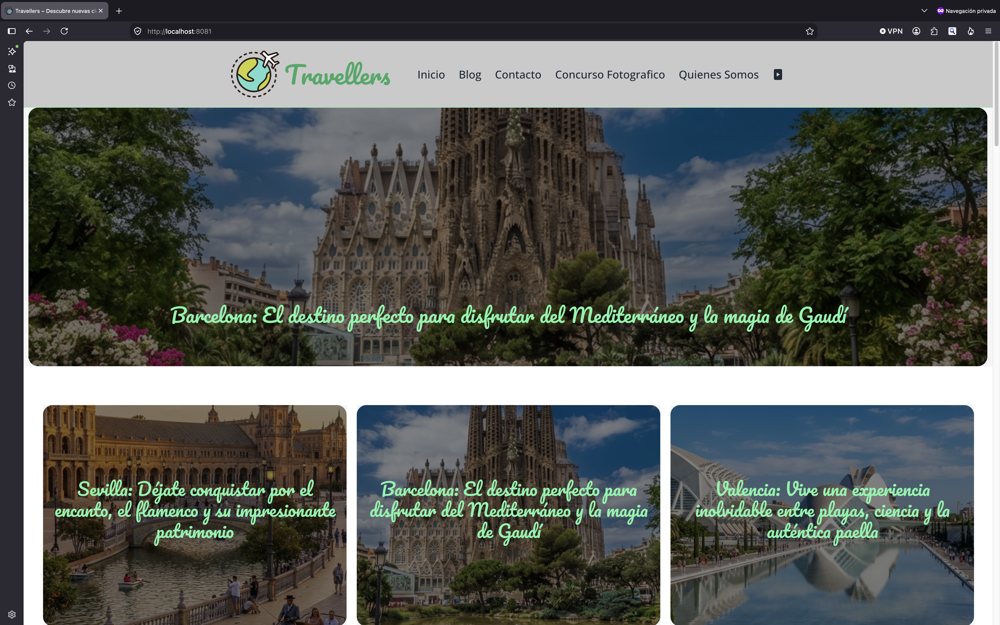
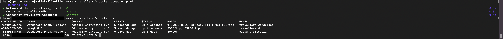
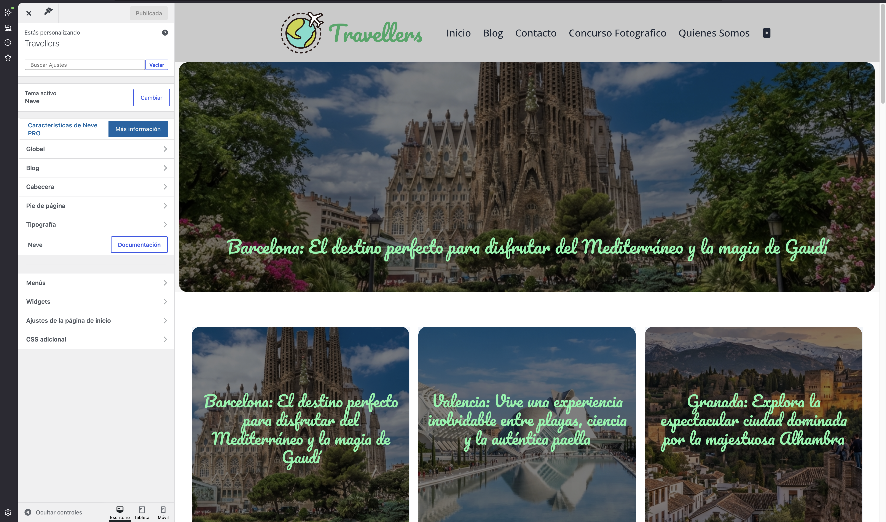
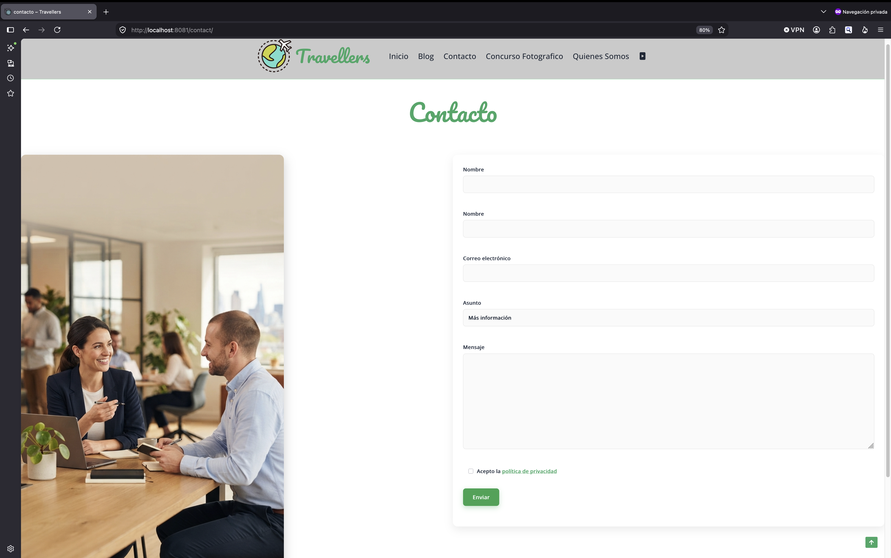
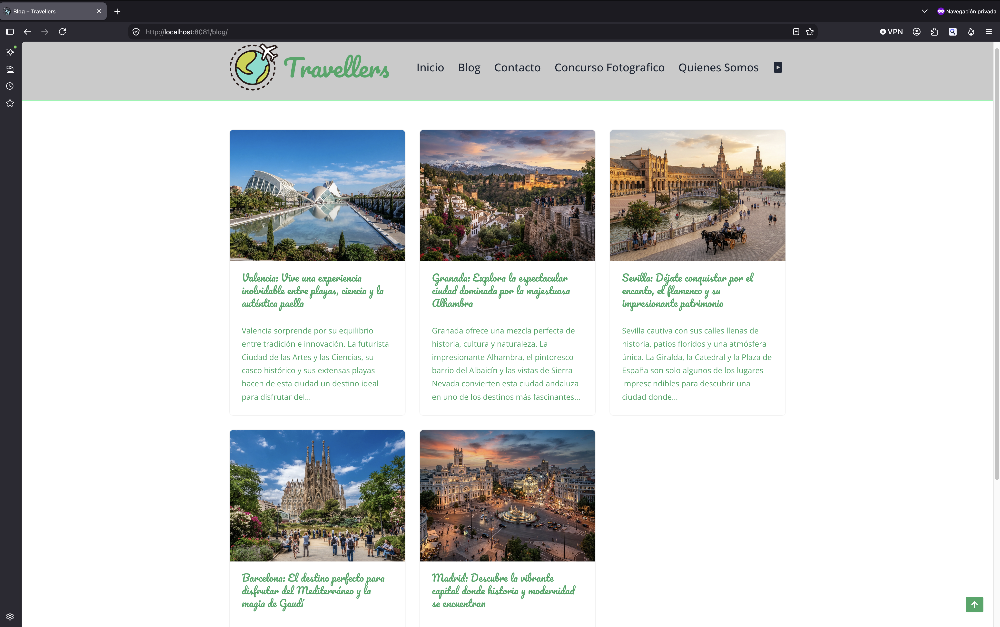
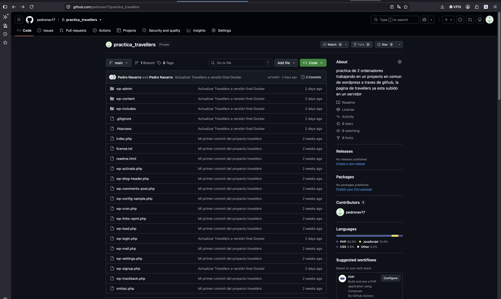
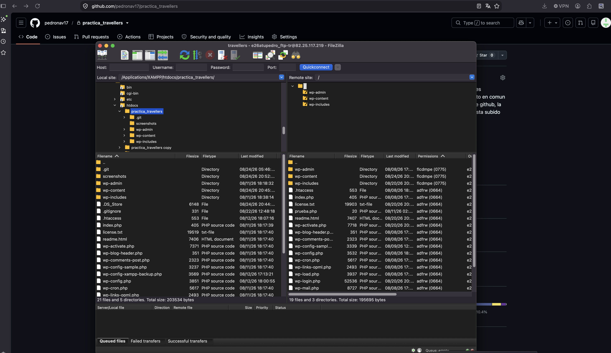
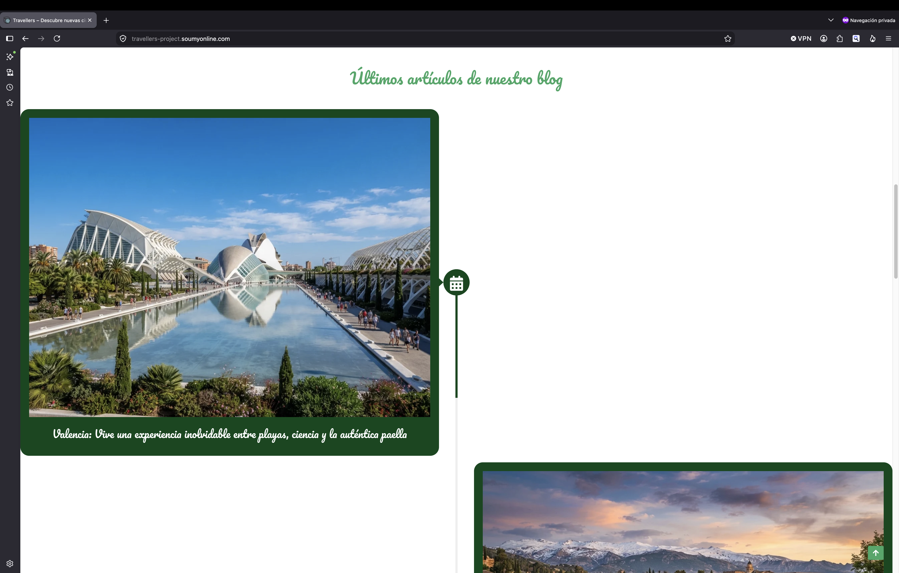

# Travellers – Travel Blog Website

## Project Overview

Travellers is a travel blog website developed as part of an academic web development project.

The original assignment provided the basic design requirements, including a colour palette and a selection of recommended WordPress plugins. I decided to extend the project beyond the initial requirements by adding custom CSS, implementing a fully functional contact form with email delivery, creating the website content and imagery, and deploying the completed website to a live environment.

The project also allowed me to work through a complete development and deployment workflow, including local WordPress development, Docker, Git/GitHub, FTP deployment and WordPress migration.

---

## Project Highlights

- WordPress website development and customization
- Neve theme customization with additional CSS
- Functional contact form and email delivery
- Docker-based local development environment
- PHP 8.4, Apache and MySQL configuration
- Git and GitHub version control
- FTP deployment using FileZilla
- WordPress migration between environments
- Troubleshooting of file permission and environment issues
- Live deployment to a custom subdomain

---

## Features

- Responsive travel blog
- Custom WordPress design
- Travel-related content and imagery
- Image sliders and carousels
- Contact form
- Email notifications
- Image optimization
- WordPress content management
- Custom CSS styling
- Live deployment

---

## Technologies & Tools

### Core Technologies

- WordPress
- PHP 8.4
- Apache
- MySQL
- Docker
- Git
- GitHub

### WordPress Theme

- Neve

### WordPress Plugins

- Contact Form 7
- WP Mail SMTP
- Smart Slider 3
- reSmush.it Image Optimizer
- Spectra Legacy
- Yoast Duplicate Post

### Front-End

- HTML
- CSS
- Custom CSS

### Deployment

- FileZilla
- Web hosting environment
- WordPress database migration

---

## Development Environment

The project was initially developed using XAMPP.

The WordPress installation was located inside the XAMPP web directory:

    XAMPP/xamppfiles/htdocs/practica_travellers/

During development, PHP version compatibility became an issue with the local XAMPP environment. To provide a more suitable and consistent development environment, I moved the project workflow to Docker.

The Docker configuration was maintained separately from the WordPress project:

    ~/docker-travellers/
    └── docker-compose.yml

The final local Docker environment consisted of:

- WordPress
- PHP 8.4
- Apache
- MySQL

The Travellers project was configured to run locally through port `8081`.

---

## Docker

Docker was introduced after encountering PHP compatibility issues with the original XAMPP environment.

Using Docker made it possible to run the project with a controlled environment based on PHP 8.4, Apache and MySQL.

The project and Docker configuration were kept as separate components:

    WordPress project
    └── XAMPP/xamppfiles/htdocs/practica_travellers/

    Docker configuration
    └── ~/docker-travellers/docker-compose.yml

This separation made the local development environment easier to manage while keeping the WordPress project files independent from the container configuration.

---

## Troubleshooting: File Permissions

One of the first technical challenges occurred while working with the WordPress project inside the XAMPP `htdocs` directory.

The project files could not be modified and the system returned:

    Permission denied

The problem was investigated by checking the directory ownership and permissions and then adjusting the local environment so that the project files could be accessed and modified correctly.

This was an important part of setting up the development environment before continuing with the project.

---

## WordPress Customization

The website uses the **Neve** theme as its foundation.

The original assignment provided a basic visual direction, but additional customization was implemented to create a more complete final website.

Custom CSS was added to extend the theme's default styling and achieve the required visual design.

Elementor was not used in this project. The website was developed using WordPress, the Neve theme and the selected plugins.

---

## Contact Form & Email Configuration

A functional contact form was implemented using **Contact Form 7**.

**WP Mail SMTP** was configured to handle email delivery, and the form was tested to verify that messages could be successfully submitted and received.

This ensured that the contact section was functional rather than being only a visual component.

---

## Sliders, Components & Image Optimization

Several WordPress plugins were used to extend the functionality of the website.

### Smart Slider 3

Used to create image sliders and visual content sections.

### Spectra Legacy

Used to provide additional WordPress blocks and page-building functionality.

### reSmush.it Image Optimizer

Used to optimize website images and reduce their file size.

### Yoast Duplicate Post

Used to facilitate the management and duplication of WordPress content during development.

---

## Content Creation

The travel content and visual material used throughout the website were created specifically for the project.

AI-assisted tools were used during the content and image creation process, together with custom prompts, to produce travel-related material suitable for the website.

---

## Development Workflow

The project followed the following development and deployment workflow:

    Local WordPress Development
                ↓
             XAMPP
                ↓
       PHP Compatibility Issue
                ↓
             Docker
                ↓
    WordPress + PHP 8.4 + Apache + MySQL
                ↓
          Git Repository
                ↓
             GitHub
                ↓
           FileZilla
                ↓
          Test Domain
                ↓
       Final WordPress Migration
                ↓
    travellers-project.soumyonline.com

---

## Version Control

Git was used to manage the project during development.

The local project was initialized as a Git repository and connected to GitHub.

Repository:

**pedronav17/practica_travellers**

The repository is currently private while the project documentation and configuration are being reviewed.

Before making the repository public, sensitive configuration information such as credentials, passwords and private server information will be removed.

---

## Deployment

After completing the local development process, the WordPress installation was uploaded to a test server using **FileZilla**.

The test deployment was used to verify that the website worked correctly in a real hosting environment before completing the final migration.

The deployment process involved transferring the WordPress files to the server and configuring the corresponding WordPress environment.

---

## WordPress Migration

After validating the website in the test environment, the project was migrated to its final subdomain:

**https://travellers-project.soumyonline.com**

The migration involved transferring the WordPress files and database, updating the required WordPress configuration and URL references, and verifying that the website and WordPress administration area were working correctly.

The final deployment was tested to ensure that the website, internal URLs and WordPress functionality were operational.

---

## Challenges & Solutions

### PHP Compatibility

**Challenge**

The original XAMPP environment presented PHP version compatibility issues during development.

**Solution**

The development workflow was moved to Docker, allowing the project to run using PHP 8.4 together with Apache and MySQL.

---

### File Permissions

**Challenge**

WordPress files located inside the XAMPP `htdocs` directory could not be modified and generated `Permission denied` errors.

**Solution**

The directory ownership and permissions were investigated and adjusted so that the local user and development environment could correctly access and modify the project files.

---

### Deployment & Migration

**Challenge**

The website needed to be transferred from the local development environment to a live server and subsequently migrated from a test environment to its final subdomain.

**Solution**

FileZilla was used to transfer the WordPress installation to the server. After validating the test deployment, the website was migrated to the final subdomain and the WordPress configuration and URLs were updated and verified.

---

## Screenshots

### Homepage

### Website Content

### Contact Form

### WordPress & Neve

### Docker Development Environment

### GitHub Repository

### FileZilla Deployment

### Final Deployment

---

## Live Demo

**[Visit the Travellers website](https://travellers-project.soumyonline.com)**

---

## What I Learned

This project allowed me to work through the complete lifecycle of a WordPress website, from local development and environment configuration to version control, deployment and migration.

Key areas of learning included:

- Managing WordPress in different development environments
- Working with Docker, Apache, PHP and MySQL
- Troubleshooting local file permission issues
- Configuring WordPress plugins
- Configuring email delivery with WP Mail SMTP
- Using Git and GitHub for version control
- Deploying a website using FTP
- Migrating a WordPress installation between environments
- Troubleshooting WordPress URL and domain configuration
- Extending a WordPress theme using custom CSS

---

## Future Improvements

Possible future improvements include:

- Further front-end refinements
- Additional responsive design improvements
- Expanded travel content
- Further performance optimization
- Additional accessibility improvements
- SEO optimization and content strategy